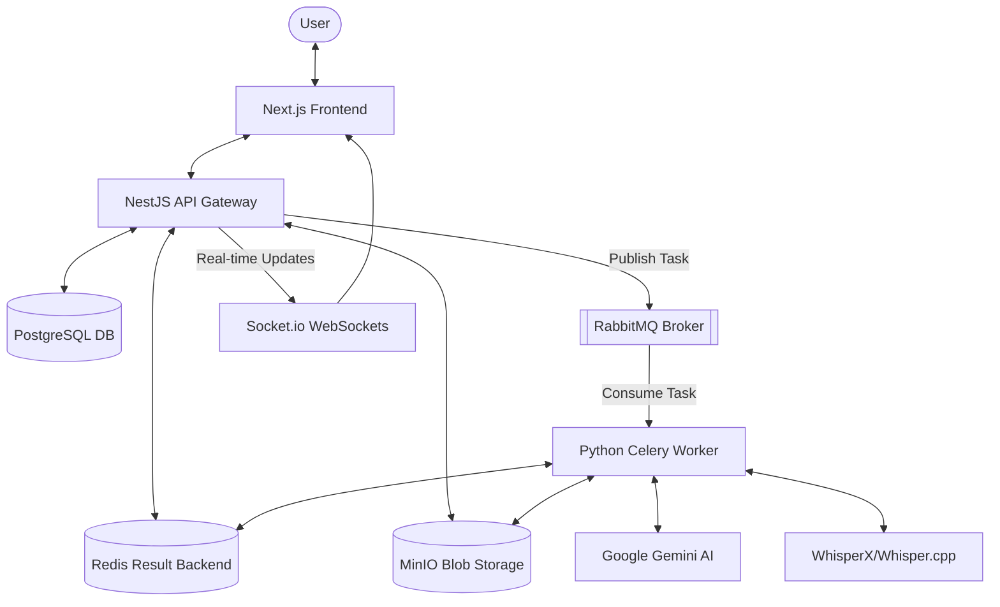
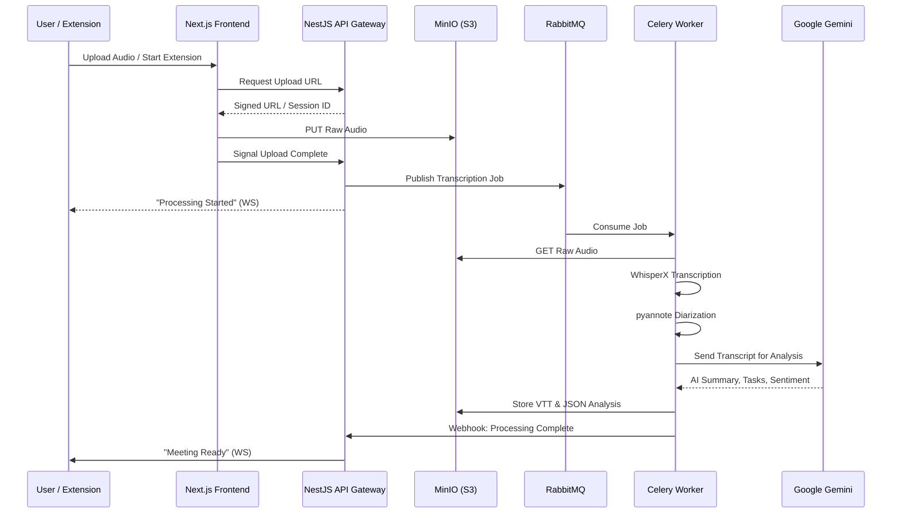

<p align="center">
  
</p>

<h1 align="center">SupaMeet - Open Source AI Meeting Assistant</h1>

<p align="center">
  <strong>The ultimate open-source platform for automated meeting transcription, speaker diarization, and AI-powered meeting summaries using Whisper and Google Gemini.</strong>
</p>

<p align="center">
  <a href="https://opensource.org/licenses/MIT"></a>
  <a href="https://nextjs.org/"></a>
  <a href="https://nestjs.com/"></a>
  <a href="https://www.python.org/"></a>
  <a href="https://docs.celeryq.dev/"></a>
  <br />
  <a href="https://www.docker.com/"></a>
  <a href="https://redis.io/"></a>
  <a href="https://www.rabbitmq.com/"></a>
  <a href="https://www.postgresql.org/"></a>
  <a href="https://www.prisma.io/"></a>
</p>


## 🌍 Works with Every Meeting Platform

SupaMeet is platform-agnostic. Whether you're in a scheduled boardroom sync or a quick huddle, we've got you covered.

<p align="center">
  
  
  
  
  
  
</p>

## 🚀 Key Features: AI Meeting Transcription & Insights

SupaMeet is designed to be the most comprehensive **AI Meeting Assistant** for developers and teams who value privacy and high-quality insights.

- 🎙️ **High-Accuracy Transcription**: Powered by **OpenAI Whisper (WhisperX)**, SupaMeet provides word-level timestamps and near-perfect speech-to-text for MP3, WAV, and M4A files.
- 👥 **Advanced Speaker Diarization**: Utilize **pyannote-audio** to automatically identify and label different speakers in your meeting recordings.
- 🤖 **AI-Powered Meeting Summaries**: Leverage **Google Gemini AI** to generate smart meeting titles, executive summaries, and high-priority action items automatically.
- 🌐 **Chrome Extension for Browser Recording**: Record Google Meet, Zoom, and Microsoft Teams directly from your browser with our seamless one-click extension.
- ⏱️ **Real-Time WebSocket Updates**: Monitor your transcription and analysis progress in real-time with **Socket.io** integration.
- 🔍 **Global Full-Text Search**: Search through your entire history of transcripts, summaries, and meeting notes with a powerful global search engine.

## 🏗️ System Architecture

Built for scale, privacy, and speed. Our microservices architecture ensures that even your longest meetings are processed without a hitch.



### Core Components
- **Frontend**: A modern Next.js 15 application utilizing Tailwind CSS and Radix UI for a responsive, accessible user experience.
- **Backend (API)**: A NestJS 11 Gateway that manages authentication, meeting metadata, file uploads, and coordinates with the worker pool.
- **Worker Service**: A high-performance Python 3.12 service powered by Celery, specialized in audio transcription, speaker diarization, and AI-driven analysis.
- **Blob Storage**: MinIO (S3-compatible) for secure and scalable storage of raw audio, transcripts, and analysis reports.
- **Messaging**: RabbitMQ as the robust message broker for task distribution and Redis for task result tracking and caching.

---

## 🛠️ Tech Stack & Architecture

SupaMeet is built with a scalable **Microservices Architecture** to handle enterprise-grade audio processing workloads.

| Layer | Technologies |
| :--- | :--- |
| **Frontend** | **Next.js 15**, React 19, TypeScript, Tailwind CSS, Radix UI, TanStack Query |
| **API Gateway** | **NestJS 11**, Prisma ORM, PostgreSQL, Passport.js (JWT), Socket.io |
| **Worker Engine** | **Python 3.12**, **Celery**, WhisperX, pywhispercpp, pyannote-audio |
| **AI / NLP** | **Google Gemini (GenAI)**, Hugging Face Transformers, PyTorch |
| **Infrastructure** | **Docker**, MinIO (S3), RabbitMQ, Redis, Nginx |

---

## 🔄 How SupaMeet Works (The Recording Lifecycle)



1.  **Ingestion**: Capture audio via the **SupaMeet Browser Extension** or direct upload to the web dashboard.
2.  **Secure Storage**: Audio files are stored in a private **MinIO** S3 bucket using secure pre-signed URLs.
3.  **Task Queuing**: **RabbitMQ** handles asynchronous job distribution to prevent system bottlenecks.
4.  **AI Processing**: The **Celery Worker** runs WhisperX for transcription and pyannote for speaker identification.
5.  **LLM Analysis**: **Google Gemini** processes the transcript to extract action items, key points, and sentiment.
6.  **Delivery**: Results are pushed to the frontend via **WebSockets**, making the analysis available instantly.

---

## 📂 Project Structure

SupaMeet is organized into a modular monorepo structure, allowing for independent scaling and development of each service.

```text
supameet/
├── 🌐 backend/                 # NestJS 11 API Gateway
│   ├── src/
│   │   ├── auth/              # JWT-based authentication & strategies
│   │   ├── meetings/          # Meeting management & session coordination
│   │   ├── notifications/     # Socket.io gateways for real-time updates
│   │   ├── prisma/            # Type-safe database service
│   │   ├── storage/           # MinIO S3 adapter for file management
│   │   ├── tasks/             # Action item management (To-dos)
│   │   └── workers/           # RabbitMQ producers for task distribution
│   ├── prisma/                # Database schema (schema.prisma) & migrations
│   └── Dockerfile             # Production NestJS build
│
├── 🎨 frontend/                # Next.js 15 Web Dashboard
│   ├── app/                   # App Router: Layouts & Dashboard pages
│   ├── components/            # UI library using Shadcn/UI & Radix
│   │   ├── shared/            # Reusable UI primitives
│   │   └── ui/                # Core Radix-based components
│   ├── hooks/                 # Custom React hooks (Queries & Mutations)
│   ├── lib/                   # Utility functions & API clients (Axios)
│   └── Dockerfile             # Multi-stage Next.js build
│
├── ⚙️ worker/                  # Python 3.12 Celery Worker
│   ├── core/                  # Celery config, RabbitMQ/Redis adapters
│   ├── services/
│   │   ├── ai_analysis/       # Google Gemini (GenAI) integration logic
│   │   └── transcription/     # WhisperX & pyannote-audio pipeline
│   ├── pyproject.toml         # Python dependencies (uv-managed)
│   └── Dockerfile             # Optimized PyTorch/CUDA environment
│
├── 🧩 browser-extension/       # Chrome/Edge Meeting Recorder
│   ├── manifest.json          # Extension V3 configuration
│   ├── js/
│   │   ├── background.js      # Recording coordinator & API sync
│   │   └── offscreen.js       # High-performance tab audio capture
│   └── html/                  # Popup & offscreen capture documents
│
├── 📚 docs/                    # Detailed API & implementation guides
└── 🐳 docker-compose.yml       # Full infrastructure orchestration
```

---

## 🗺️ Roadmap: The Future of SupaMeet

- [ ] **MCP (Model Context Protocol) Support**: Enable AI agents to query your meeting history securely.
- [ ] **Google Workspace & MS 365 Integration**: Sync calendars and push notes directly to Google Docs.
- [ ] **Live Meeting Transcription**: Real-time captions and summaries during live sessions.
- [ ] **Custom AI Personalities**: Summarize meetings from a Developer, PM, or Sales perspective.
- [ ] **Team Collaboration**: Shared folders and automated Slack/Discord highlights.

---

## 💻 Installation & Getting Started

### Prerequisites
- [Docker](https://www.docker.com/) & [Docker Compose](https://docs.docker.com/compose/)
- Google Gemini API Key

### Quick Start with Docker
1. **Clone the Repository**:
   ```bash
   git clone https://github.com/your-username/supameet.git
   cd supameet
   ```
2. **Configure Environment**:
   ```bash
   cp .env.example .env # Add your GENAI_API_KEY
   ```
3. **Run SupaMeet**:
   ```bash
   docker-compose up --build
   ```
4. **Access SupaMeet**:
   - Web Dashboard: [http://localhost:3001](http://localhost:3001)
   - API Documentation: [http://localhost:3000/api](http://localhost:3000/api)
   - Monitoring (Flower): [http://localhost:5555](http://localhost:5555)

---

## ⚙️ Development

For service-specific details, please refer to:
- [Backend Development Guide](./backend/README.md)
- [Frontend Development Guide](./frontend/README.md)
- [Worker Service Guide](./worker/README.md)

---

## 📄 License
SupaMeet is licensed under the **MIT License**.

Made with ❤️ in _India_
